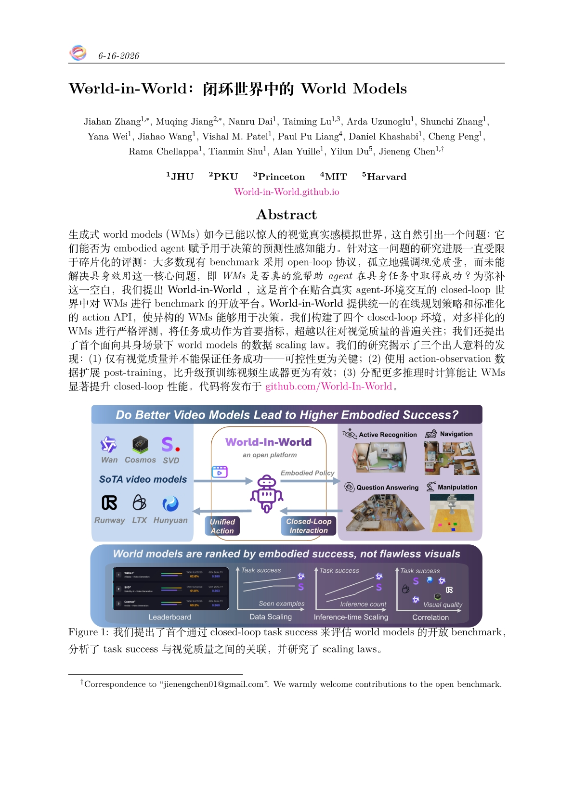
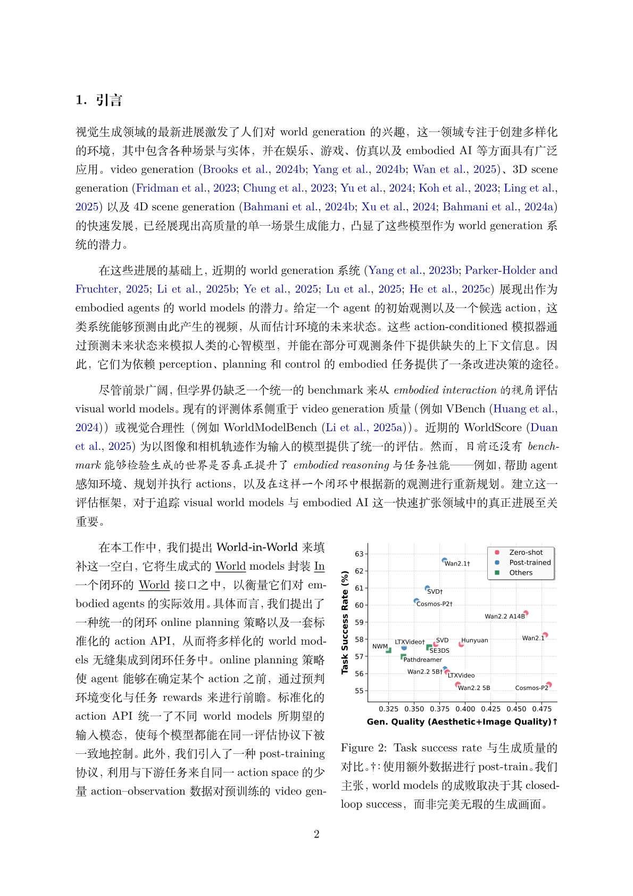
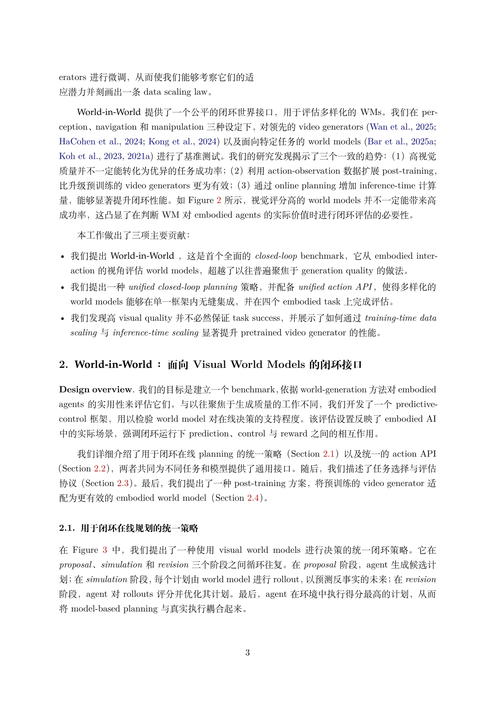
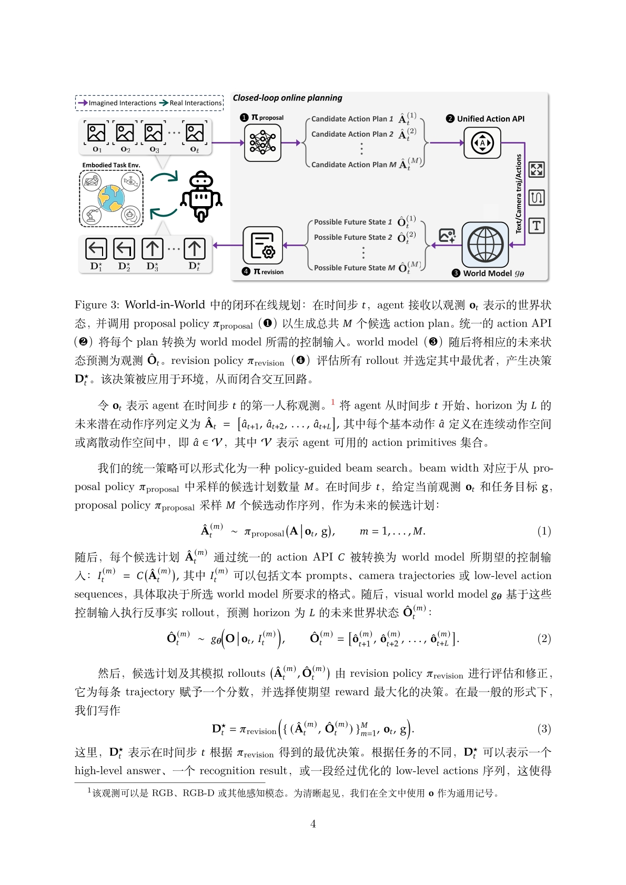

<div align="center">

</img>

**把 arXiv / LaTeX 论文端到端翻译成保留排版的多语言 PDF**

中文 | [English (原版)](README_EN.md)

</div>

---

> 本仓库是在 [NiuTrans/LaTeXTrans](https://github.com/NiuTrans/LaTeXTrans) 基础上的**增强版**。
> 在原有"多智能体结构化 LaTeX 翻译"能力之上，主要新增了三块：
> 1. **本地 Claude Code 翻译后端** —— 直接调用你本机已登录的 `claude` 命令行来翻译，无需 API key；
> 2. **可完全自定义的翻译 Prompt** —— 支持配置文件覆盖，并提供图形界面在线编辑、保存、恢复默认；
> 3. **增强的 Streamlit 图形界面** —— 后端 / 模型 / 推理强度下拉选择、Prompt 编辑器、实时进度与日志。

# 📖 简介

TeXClaudeTrans 是一个基于多智能体协作的**结构化 LaTeX 文档翻译系统**。它直接翻译 LaTeX 源码并生成高度还原原排版的译文 PDF。与传统的 PDF 翻译不同，它不会破坏公式与版式，而是把 LaTeX 源码解析成结构化的 JSON 中间表示，只把其中的自然语言部分交给大模型翻译，再校验 LaTeX 完整性、重建并编译出译文项目。

**核心特点：**
- 🌟 **保持公式、版式、交叉引用的完整性**
- 🌟 **术语翻译的一致性**（可选术语表）
- 🌟 **端到端**：从 arXiv ID（自动下载源码）一路到译文 PDF
- 🌟 **两种翻译后端**：OpenAI 兼容 API，或本地 Claude Code（无需 API key）

# 📄 效果

<table>
  <tr>
    <td></td>
    <td></td>
  </tr>
  <tr>
    <td></td>
    <td></td>
  </tr>
</table>


# 🛠️ 安装


### 1. 安装 Python 依赖

```bash
pip install -e .            # 安装依赖，并注册 latextrans / latextrans-gui 命令
# 或者只装依赖、用 python 直接运行：
pip install -r requirements.txt
```

> 若不执行 `pip install -e .`，可用 `python main.py ...` 和
> `python -m streamlit run src/gui/streamlit_app.py` 代替下文的 `latextrans` / `latextrans-gui` 命令。

### 2. 安装 TeX 发行版（编译 PDF 需要）

需要 `pdflatex` / `xelatex` 在 `PATH` 中。翻译本身（产出 JSON 中间结果）不需要 TeX，只有最后一步编译 PDF 需要。

- **Linux / WSL**：精简安装即可覆盖中文论文（约 1–1.5GB）：
  ```bash
  sudo apt install -y texlive-latex-base texlive-latex-recommended texlive-latex-extra \
    texlive-xetex texlive-lang-chinese texlive-fonts-recommended fonts-noto-cjk
  ```
- **Windows**：安装 [MiKTeX](https://miktex.org/download)（建议勾选 "install on the fly"）或 [TeX Live](https://www.tug.org/texlive/)。

### 3.（仅 claude_code 后端）安装并登录 Claude Code CLI

如果要用本地 Claude 翻译，需要本机装有 [Claude Code](https://claude.com/claude-code) 命令行并已登录（OAuth）。验证：

```bash
claude --version
```

### 4.（仅 codex 后端）安装并登录 OpenAI Codex CLI

如果要用本地 codex 翻译（复用 ChatGPT 订阅、免 API key），安装 codex CLI 并登录：

```bash
curl -fsSL https://chatgpt.com/codex/install.sh | sh   # 独立二进制，不依赖 Node
codex login                                            # 用 ChatGPT 账号登录
codex --version
```

> 可选：装系统沙盒工具 `bubblewrap`（**不是 pip 包，用系统包管理器装**）让 codex 的只读沙盒更规范；不装也能用（codex 会用内置的）：
> ```bash
> sudo apt install bubblewrap     # Debian/Ubuntu/WSL
> ```

# ⚙️ 配置

编辑 `config/default.toml`：

```toml
[llm_config]
# 翻译后端："api"（OpenAI 兼容接口）或 "claude_code"（本地 claude 命令行）
backend = "api"

# backend = "api" 时：填模型名 / api_key / base_url
# backend = "claude_code" 时：model 作为 claude 别名（opus/sonnet/haiku/fable，可留空用默认），
#   api_key / base_url 被忽略（走你本地 Claude Code 登录）
model = ""
api_key = ""
base_url = ""

# effort（仅 claude_code）：推理强度 —— ""/low/medium/high/xhigh/max
effort = ""
```

**两种后端对比：**

| | `api` | `claude_code` |
|---|---|---|
| 调用方式 | HTTP 调 OpenAI 兼容 `/v1/chat/completions` | 本地起 `claude -p` 子进程 |
| 鉴权 | 需要 `api_key` | 用你已登录的 Claude Code（无需 key） |
| 模型 | 任意模型名（deepseek-chat、gpt-4o…） | claude 别名 opus/sonnet/haiku/fable |
| 推理强度 | 不支持 | 支持 `effort` |
| 并发 | 默认 10 | 默认 4（子进程较重） |

> `api` 模式的 `base_url` 必须是完整的 completions 端点，例如：
> | 模型 | base_url |
> |:-|:-|
> | deepseek-chat | https://api.deepseek.com/v1/chat/completions |
> | gpt-4o | https://api.openai.com/v1/chat/completions |
> | gemini-2.5-pro | https://generativelanguage.googleapis.com/v1beta/openai/chat/completions |

# 📚 使用

## 命令行

```bash
# 通过 arXiv ID（自动下载源码，支持带版本号如 2501.12948v1）
latextrans --arxiv 2501.12948

# 批量（逗号分隔）
latextrans --arxiv 2501.12948, 2407.01648

# 本地项目目录 或 压缩包（.zip/.tar/.tar.gz/.tgz）
latextrans --project path/to/source.tar.gz

# 处理 tex source/ 下已有的全部项目
latextrans --all-existing

# 用本地 Claude 翻译，并指定模型与推理强度
latextrans --backend claude_code --model sonnet --effort high --arxiv 2501.12948
```

常用参数：`--backend`、`--model`、`--effort`、`--url`、`--key`、`--output`、`--source`、`--prompt-file`、`--config`，均可覆盖配置文件。

> 只填 arXiv ID 即可，**会自动从 arXiv 下载源码**到 `tex source/`，无需自己准备。

## 图形界面（Streamlit）

```bash
latextrans-gui
# 或：python -m streamlit run src/gui/streamlit_app.py
```

浏览器打开 `http://localhost:8501`。侧边栏可设置：

- **Backend**：`api` / `claude_code`
- **Model**：claude_code 模式下为下拉（opus/sonnet/haiku/fable）；api 模式为文本框
- **Reasoning effort**：claude_code 模式下的推理强度下拉
- **Custom Translation Prompts**：展开后可在线编辑全部生效的翻译 Prompt（见下）
- 输入区填 arXiv ID 或本地项目路径，点 **Start Translation**，可看实时进度、日志与生成的 PDF

# 🎯 自定义翻译 Prompt

翻译用的系统 Prompt 可以完全自定义，对两种后端都生效。三种入口：

1. **配置文件**：`config/default.toml` 里设 `user_prompt_file = "config/prompts.example.toml"`，或命令行 `--prompt-file`；
2. **图形界面**：侧边栏展开 "Custom Translation Prompts (TOML)"，在文本框里直接编辑，**保存到文件**或**一键恢复默认**；
3. 直接编辑 `config/prompts.example.toml`。

要点：
- 文件为 TOML 格式，**必须使用单引号 `'''字面量'''` 字符串**，否则 LaTeX 反斜杠会被转义破坏；
- `{SOURCE_LANG}` / `{TARGET_LANG}` 会在运行时替换为语言名；
- 只列出你想改的 Prompt，未列出的用内置默认；
- 务必保留"仅翻译自然语言、保留 `<PLACEHOLDER_...>` 占位符"等结构约束，否则会破坏 LaTeX、导致校验/编译失败。

当前真正生效的 Prompt 共 9 个：正文 / 图表标题 / 环境块（各含术语表版本）、错误重译、术语抽取、环境是否需翻译的判断。

# 📁 输出

- 译文项目与 PDF 在 `outputs/<目标语言>_<项目名>/` 下，最终 PDF 名为 `<目标语言>_<项目名>.pdf`。
- 用 `--output` 或 GUI 的 "Output Dir" 可改输出目录。
- **WSL 用户**：可把输出设到 Windows 路径（如 `/mnt/c/Users/你/Desktop/trans`），但 `/mnt/c` 上编译较慢；更推荐保留默认 `outputs/`，再在 Windows 资源管理器用 `\\wsl$\...` 访问或复制结果。

# ⚠️ 说明

- 目前对 **英文 → 中文** 的编译适配最完善；翻到其它语言时最终 PDF 可能出现编译错误，欢迎提 issue。
- `claude_code`/`codex` 模式是逐段起独立 agent 进程、并发较低，批量翻译时较慢。

# 🙏 致谢

本项目基于 [NiuTrans/LaTeXTrans](https://github.com/NiuTrans/LaTeXTrans)。

```bibtex
@article{zhu2025latextrans,
  title={LaTeXTrans: Structured LaTeX Translation with Multi-Agent Coordination},
  author={Zhu, Ziming and Wang, Chenglong and Xing, Shunjie and Huo, Yifu and Tian, Fengning and Du, Quan and Yang, Di and Zhang, Chunliang and Xiao, Tong and Zhu, Jingbo},
  journal={arXiv preprint arXiv:2508.18791},
  year={2025}
}
```
